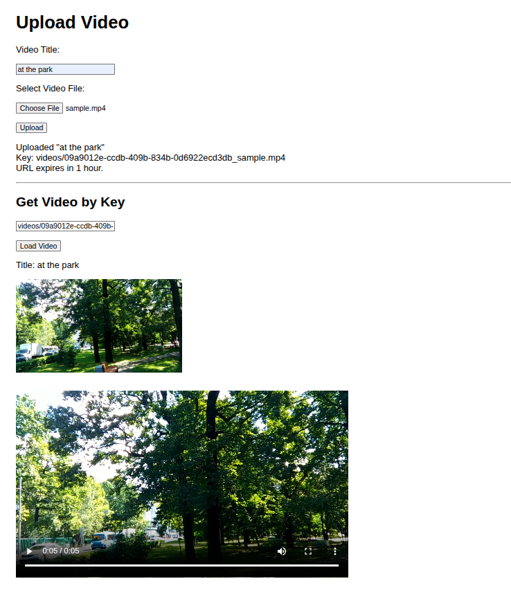

# VideoUploader
Upload a video to AWS S3 bucket with a title, then triggers AWS Lambda function to automatically generate a thumbnail from first frame. Can then download the video with the title and thumbnail image. Uses presigned URL's for the video and image sources.

## Screenshot:

